# System Architecture

This document provides a comprehensive overview of the Trump Speeches NLP Chatbot API architecture, including system components, data flows, and deployment strategies.

## Table of Contents

- [High-Level Architecture](#high-level-architecture)
- [Component Architecture](#component-architecture)
- [RAG Pipeline](#rag-pipeline)
- [Data Flow](#data-flow)
- [API Architecture](#api-architecture)
- [Deployment Architecture](#deployment-architecture)
- [Technology Stack](#technology-stack)
- [Scalability Considerations](#scalability-considerations)

---

## Project Overview (Thumbnail)

```mermaid
%%{init: {'theme':'dark', 'themeVariables': { 'primaryColor':'#667eea', 'primaryTextColor':'#fff', 'primaryBorderColor':'#764ba2', 'lineColor':'#667eea', 'secondaryColor':'#764ba2', 'tertiaryColor':'#1a1a2e'}}}%%
flowchart TB
    subgraph Client["🌐 Client Layer"]
        UI["Dark Mode UI<br/>Interactive Dashboard"]
    end
    
    subgraph API["⚡ FastAPI Backend"]
        Routes["RESTful Endpoints<br/>Async Request Handling"]
    end
    
    subgraph AI["🤖 AI Services"]
        RAG["RAG System<br/>Hybrid Search + LLM"]
        Sentiment["Sentiment Analysis<br/>Multi-Model + AI"]
        Topics["Topic Extraction<br/>Semantic Clustering"]
    end
    
    subgraph Data["💾 Data & Models"]
        Vector["ChromaDB<br/>Vector Storage"]
        Models["Transformers<br/>FinBERT • RoBERTa • MPNet"]
        LLM["LLM Providers<br/>Gemini • OpenAI • Claude"]
    end
    
    UI <-->|HTTP/JSON| Routes
    Routes --> RAG
    Routes --> Sentiment
    Routes --> Topics
    RAG <--> Vector
    RAG --> LLM
    Sentiment --> Models
    Sentiment --> LLM
    Topics --> Models
    Topics --> LLM
    
    style Client fill:#667eea,stroke:#764ba2,stroke-width:3px,color:#fff
    style API fill:#764ba2,stroke:#667eea,stroke-width:3px,color:#fff
    style AI fill:#1a1a2e,stroke:#667eea,stroke-width:2px,color:#e0e0e0
    style Data fill:#2a2a3a,stroke:#667eea,stroke-width:2px,color:#e0e0e0
```

---

## High-Level Architecture

```mermaid
%%{init: {'theme':'base', 'themeVariables': { 'primaryColor':'#f0f3ff', 'primaryTextColor':'#333', 'primaryBorderColor':'#667eea', 'lineColor':'#667eea', 'secondaryColor':'#e9ecef', 'tertiaryColor':'#fff'}}}%%
graph TB
    Client["👤 Client/Browser<br/><small>Chrome, Firefox, Safari</small>"]
    Frontend["🎨 Static Frontend<br/><small>HTML/CSS/JS • Dark Mode UI</small>"]
    API["⚡ FastAPI Application<br/><small>REST API • Async • Uvicorn</small>"]
    
    subgraph NLP["🧠 AI/NLP Services"]
        direction TB
        Sentiment["📊 Sentiment Analysis<br/><small>FinBERT + RoBERTa + LLM</small>"]
        Topics["🏷️ Topic Analysis<br/><small>Semantic Clustering + LLM</small>"]
        RAG["🔍 RAG System<br/><small>Hybrid Search + ChromaDB</small>"]
        LLMService["🤖 LLM Providers<br/><small>Gemini • OpenAI • Claude</small>"]
    end
    
    subgraph Data["💾 Data Layer"]
        direction TB
        Speeches["📚 Demo Dataset<br/><small>35+ Political Speeches</small>"]
        VectorDB[("🗄️ ChromaDB<br/><small>Vector Store • Persistent</small>")]
        Models["🎯 ML Models<br/><small>PyTorch • Transformers</small>"]
    end
    
    Client <-->|"HTTP Requests"| Frontend
    Frontend <-->|"REST API Calls<br/>/rag/ask, /analyze/*"| API
    
    API -->|"Analyze Sentiment"| Sentiment
    API -->|"Extract Topics"| Topics
    API -->|"Answer Questions"| RAG
    
    Sentiment -->|"Generate Interpretation"| LLMService
    Sentiment -->|"Classify Emotions"| Models
    Topics -->|"Generate Labels"| LLMService
    Topics -->|"Cluster Keywords"| Models
    RAG -->|"Generate Answers"| LLMService
    RAG <-->|"Semantic Search"| VectorDB
    RAG -->|"Embed Queries"| Models
    
    Topics -.->|"Load Data"| Speeches
    VectorDB -.->|"Indexed From"| Speeches
    
    style Client fill:#667eea,stroke:#764ba2,stroke-width:3px,color:#fff
    style Frontend fill:#764ba2,stroke:#667eea,stroke-width:3px,color:#fff
    style API fill:#667eea,stroke:#764ba2,stroke-width:3px,color:#fff
    style NLP fill:#f0f3ff,stroke:#667eea,stroke-width:2px
    style Data fill:#e9ecef,stroke:#667eea,stroke-width:2px
    style LLMService fill:#fff,stroke:#667eea,stroke-width:2px
```

---

## Component Architecture

### 1. **API Layer** (`src/api/`)

FastAPI application with modular route organization.

**Responsibilities:**

- HTTP request handling
- Input validation (Pydantic models)
- Error handling and logging
- CORS middleware
- Static file serving
- Dependency injection for services

**Route Modules:**

- `routes_chatbot.py` - RAG question-answering endpoints
- `routes_nlp.py` - Traditional NLP analysis endpoints
- `routes_health.py` - Health checks and system status
- `dependencies.py` - Service dependency injection

**Endpoints:**

- `/rag/ask` - RAG question answering
- `/rag/search` - Semantic search
- `/rag/stats` - Collection statistics
- `/rag/index` - Document indexing
- `/analyze/sentiment` - Sentiment analysis
- `/analyze/topics` - AI-powered topic extraction with semantic clustering
- `/analyze/ngrams` - N-gram analysis
- `/health` - Health check

### 2. **Sentiment Analysis** (`src/services/sentiment_service.py`)

AI-powered multi-model sentiment analysis with emotion detection and contextual interpretation.

**Architecture:**

- **FinBERT Model**: Financial/political sentiment classification (positive/negative/neutral)
- **RoBERTa Emotion Model**: Six-emotion detection (anger, joy, fear, sadness, surprise, disgust)
- **LLM Integration**: Contextual interpretation explaining WHY the models produced their results (supports Gemini, OpenAI, Anthropic)

**Key Features:**

- Three-class sentiment classification with confidence scores
- Six-emotion detection with individual probabilities
- AI-generated contextual interpretation (2-3 sentences, max 2000 tokens)
- Automatic text chunking for long documents
- Configurable via environment variables (model names, temperature, max tokens)
- Dark mode UI with enhanced visualization

**Processing Flow:**

```mermaid
%%{init: {'theme':'base'}}%%
flowchart LR
    Input["📝 Raw Text"] --> Chunk["📄 Text Chunking<br/><small>510 tokens max</small>"]
    Chunk --> Sentiment["🎯 FinBERT<br/><small>Sentiment Scores</small>"]
    Chunk --> Emotion["🎭 RoBERTa<br/><small>Emotion Scores</small>"]
    Sentiment --> Aggregate["📊 Aggregate Results<br/><small>Average across chunks</small>"]
    Emotion --> Aggregate
    Aggregate --> LLM["🤖 LLM Provider<br/><small>Contextual Analysis<br/>2000 token limit</small>"]
    LLM --> Output["✨ Complete Analysis<br/><small>Sentiment + Emotions<br/>+ AI Interpretation</small>"]
    
    style Input fill:#f0f3ff,stroke:#667eea,stroke-width:2px
    style Chunk fill:#fff,stroke:#667eea,stroke-width:1px
    style Sentiment fill:#e3f2fd,stroke:#2196f3,stroke-width:2px
    style Emotion fill:#fce4ec,stroke:#e91e63,stroke-width:2px
    style Aggregate fill:#fff,stroke:#667eea,stroke-width:1px
    style LLM fill:#f3e5f5,stroke:#9c27b0,stroke-width:2px
    style Output fill:#667eea,stroke:#764ba2,stroke-width:3px,color:#fff
```

**Response Schema:**

```python
{
    "sentiment": "positive",
    "confidence": 0.85,
    "scores": {
        "positive": 0.85,
        "negative": 0.08,
        "neutral": 0.07
    },
    "emotions": {
        "joy": 0.62,
        "anger": 0.15,
        "neutral": 0.12,
        "fear": 0.05,
        "sadness": 0.04,
        "surprise": 0.02
    },
    "contextual_sentiment": "The text expresses strong positive sentiment about economic achievements, with joy emerging from pride in policy success. However, underlying anger surfaces when discussing immigration, creating emotional complexity that explains the mixed sentiment profile.",
    "num_chunks": 3
}
```

### 3. **RAG Service** (`src/services/rag_service.py`)

Orchestrates the RAG pipeline, coordinating modular components for intelligent question answering.

**Architecture:**
The RAG service now uses a modular design with dedicated components:

- **Orchestration:** Manages ChromaDB collection and coordinates components
- **Delegation:** Delegates to specialized services for search, confidence, entities, and loading

**Components Used:**

- `SearchEngine` (from `services/rag/search_engine.py`)
- `ConfidenceCalculator` (from `services/rag/confidence.py`)
- `EntityAnalyzer` (from `services/rag/entity_analyzer.py`)
- `DocumentLoader` (from `services/rag/document_loader.py`)
- `LLMProvider` (from `services/llm/`) - Pluggable provider abstraction

### 5. **LLM Service** (`src/services/llm/`)

Pluggable LLM provider abstraction with support for multiple AI models.

**Architecture:**

- **Abstract Base Class** (`base.py`): Defines the `LLMProvider` interface
- **Factory Pattern** (`factory.py`): Creates providers with lazy imports for optional dependencies
- **Provider Implementations**:
  - `gemini.py` - Google Gemini (default, always available)
  - `openai.py` - OpenAI GPT models (optional: `uv sync --group llm-openai`)
  - `anthropic.py` - Anthropic Claude models (optional: `uv sync --group llm-anthropic`)

**Features:**

- **Model-Agnostic Configuration**: Single config interface (`LLM_API_KEY`, `LLM_MODEL_NAME`)
- **Easy Provider Switching**: Change providers via `LLM_PROVIDER` environment variable
- **Optional Dependencies**: Only install providers you need
- **Type-Safe Interface**: All providers implement the same `LLMProvider` interface
- **Context-Aware Prompting**: Builds prompts with retrieved context
- **Entity-Focused Generation**: Emphasizes entity mentions when applicable
- **Fallback Extraction**: Returns context snippets if LLM fails
- **Source Attribution**: Tracks and cites source documents
- **Error Handling**: Graceful degradation with informative fallbacks

**Provider Interface:**

```python
class LLMProvider(ABC):
    @abstractmethod
    def generate_content(
        self,
        prompt: str,
        temperature: Optional[float] = None,
        max_output_tokens: Optional[int] = None
    ) -> str:
        """Generate text based on the given prompt."""
        pass
```

**Usage Example:**

```python
from src.services.llm import create_llm_provider

# Create provider based on LLM_PROVIDER env variable
llm = create_llm_provider()

# Generate content (works with any provider)
response = llm.generate_content(
    prompt="Explain the economic policies mentioned...",
    temperature=0.7,
    max_output_tokens=2048
)
```

### 6. **Text Preprocessing** (`src/utils/text_preprocessing.py`)

Modular, testable components for RAG functionality.

### 4. **RAG Components** (`src/services/rag/`)

Modular, testable components for RAG functionality.

#### 4.1 **SearchEngine** (`search_engine.py`)

Hybrid search engine combining multiple retrieval strategies.

**Features:**

- **Semantic Search:** MPNet embeddings (768d) with cosine similarity
- **BM25 Search:** Keyword-based sparse retrieval
- **Hybrid Search:** Configurable weighting of semantic + BM25 scores
- **Cross-encoder Reranking:** Final precision optimization
- **Deduplication:** Removes duplicate results by ID

**Search Modes:**

- `semantic` - Pure vector similarity search
- `hybrid` - Combines semantic + BM25 (default weights: 0.7/0.3)
- `reranking` - Optional cross-encoder for top results

#### 4.2 **ConfidenceCalculator** (`confidence.py`)

Multi-factor confidence scoring for RAG answers.

**Confidence Factors (weighted):**

- **Retrieval Quality (40%):** Average semantic similarity of results
- **Consistency (25%):** Score variance (low variance = high confidence)
- **Coverage (20%):** Normalized chunk count (more chunks = better coverage)
- **Entity Coverage (15%):** Percentage of results mentioning query entities

**Confidence Levels:**

- **High:** combined_score ≥ 0.7
- **Medium:** 0.4 ≤ combined_score < 0.7
- **Low:** combined_score < 0.4

**Output:**

- Confidence level (high/medium/low)
- Numeric confidence score (0-1)
- Detailed explanation
- Individual factor scores

#### 4.3 **EntityAnalyzer** (`entity_analyzer.py`)

Entity extraction and statistical analysis.

**Capabilities:**

- **Entity Extraction:** Identifies capitalized words (filtered for stopwords, question words)
- **Mention Counting:** Tracks entity mentions across corpus
- **Speech Coverage:** Identifies which documents mention each entity
- **Sentiment Analysis:** Average sentiment toward entity (optional)
- **Co-occurrence Analysis:** Most common words appearing near entity
- **Corpus Percentage:** Percentage of documents mentioning entity

**Statistics Output:**

```python
{
    "mention_count": 524,
    "speech_count": 30,
    "corpus_percentage": 85.7,
    "speeches": ["file1.txt", "file2.txt", ...],
    "sentiment": {
        "average_score": -0.15,
        "classification": "Neutral",
        "sample_size": 50
    },
    "associations": ["people", "country", "great", ...]
}
```

#### 4.4 **DocumentLoader** (`document_loader.py`)

Smart document loading and chunking.

**Features:**

- **Recursive Text Splitting:** LangChain RecursiveCharacterTextSplitter
- **Configurable Chunking:** Default 2048 chars (~512-768 tokens)
- **Overlap:** 150 char overlap for context continuity
- **Metadata Tracking:** Preserves source filename, chunk index, total chunks
- **Directory Loading:** Batch loading from directories with progress tracking

**Chunking Strategy:**

```python
chunk_size = 2048       # ~512-768 tokens (full context)
chunk_overlap = 150     # ~100-150 tokens (preserve continuity)
```

### 5. **LLM Service** (`src/services/llm_service.py`)

Google Gemini integration for answer generation.

**Features:**

- **Context-Aware Prompting:** Builds prompts with retrieved context
- **Entity-Focused Generation:** Emphasizes entity mentions when applicable
- **Fallback Extraction:** Returns context snippets if LLM fails
- **Source Attribution:** Tracks and cites source documents
- **Error Handling:** Graceful degradation with informative fallbacks

### 4. **Text Preprocessing** (`src/utils/text_preprocessing.py`)

Text cleaning and normalization utilities.

**Functions:**

- Stopword removal (NLTK)
- Tokenization
- Special character removal
- URL removal
- N-gram extraction

### 7. **Utilities** (`src/utils/`)

Data loading and analysis helpers.

**Modules:**

- `io_helpers.py` - Speech loading and dataset statistics
- `formatters.py` - Response formatting utilities
- `text_preprocessing.py` - Text cleaning and tokenization

### 8. **AI-Powered Topic Analysis** (`src/services/topic_service.py`)

Advanced topic extraction with semantic clustering and LLM-generated insights.

**Features:**

- **Semantic Clustering:** Groups related keywords using sentence embeddings (MPNet) and KMeans
- **AI-Generated Labels:** Uses LLM to create meaningful cluster labels (e.g., "Border Security" instead of just "wall")
- **Contextual Snippets:** Extracts text passages showing keywords in use with highlighting
- **Topic Summaries:** LLM-generated interpretation of main themes and patterns
- **Smart Filtering:** Excludes common verbs and low-relevance clusters (< 50% avg relevance)

**Processing Pipeline:**

```mermaid
%%{init: {'theme':'base'}}%%
flowchart TB
    Text["📝 Input Text"] --> Extract["🔍 Extract Keywords<br/><small>TF-IDF + Filtering</small>"]
    Extract --> Embed["🎯 Generate Embeddings<br/><small>MPNet (768d)</small>"]
    Embed --> Cluster["🔄 Semantic Clustering<br/><small>KMeans Algorithm</small>"]
    Cluster --> Label["🏷️ Generate Labels<br/><small>LLM Provider</small>"]
    Label --> Snippets["📄 Extract Snippets<br/><small>Context Windows</small>"]
    Snippets --> Summary["✨ Generate Summary<br/><small>LLM Provider</small>"]
    Summary --> Output["📊 Final Output<br/><small>Clustered Topics<br/>+ Snippets + Summary</small>"]
    
    style Text fill:#f0f3ff,stroke:#667eea,stroke-width:2px
    style Extract fill:#fff3e0,stroke:#ff9800,stroke-width:2px
    style Embed fill:#e8f5e9,stroke:#4caf50,stroke-width:2px
    style Cluster fill:#e1f5fe,stroke:#03a9f4,stroke-width:2px
    style Label fill:#f3e5f5,stroke:#9c27b0,stroke-width:2px
    style Snippets fill:#fff,stroke:#667eea,stroke-width:1px
    style Summary fill:#f3e5f5,stroke:#9c27b0,stroke-width:2px
    style Output fill:#667eea,stroke:#764ba2,stroke-width:3px,color:#fff
```

**Key Advantages:**

- Groups synonyms and related concepts automatically (e.g., "economy", "jobs", "employment" → "Economic Policy")
- Provides real-world context with highlighted examples
- Ranks by semantic relevance, not just frequency
- Offers human-readable interpretation via AI
- Filters out generic verbs and weak clusters

---

## RAG Pipeline

Modular architecture for Retrieval-Augmented Generation.

```mermaid
%%{init: {'theme':'base'}}%%
flowchart TB
    subgraph Orchestrator["🎯 RAG Service (Orchestrator)"]
        RagService["RAGService<br/><small>Collection Management<br/>Component Coordination</small>"]
    end
    
    subgraph Indexing["📚 Indexing Pipeline"]
        direction LR
        Loader["📄 DocumentLoader<br/><small>Chunking & Metadata</small>"]
        Embedder["🎯 Embedding Model<br/><small>all-mpnet-base-v2<br/>768 dimensions</small>"]
        DB[("🗄️ ChromaDB<br/><small>Vector Store<br/>Persistent</small>")]
        
        Loader --> Embedder
        Embedder --> DB
    end
    
    subgraph Query["🔍 Query Pipeline"]
        direction TB
        Search["🔎 SearchEngine<br/><small>Hybrid Retrieval<br/>Semantic + BM25</small>"]
        Entities["🏷️ EntityAnalyzer<br/><small>Extraction & Stats</small>"]
        Confidence["📊 ConfidenceCalculator<br/><small>Multi-factor Scoring</small>"]
        LLM["🤖 LLM Provider<br/><small>Answer Generation<br/>Gemini/OpenAI/Claude</small>"]
    end
    
    RagService -.->|"Index Documents"| Loader
    RagService <-->|"Query"| Search
    Search <-->|"Retrieve"| DB
    RagService -->|"Extract Entities"| Entities
    Entities <-->|"Analyze"| DB
    RagService -->|"Calculate"| Confidence
    RagService -->|"Generate Answer"| LLM
    
    style Orchestrator fill:#667eea,stroke:#764ba2,stroke-width:3px,color:#fff
    style Indexing fill:#f0f3ff,stroke:#667eea,stroke-width:2px
    style Query fill:#e9ecef,stroke:#667eea,stroke-width:2px
    style RagService fill:#764ba2,stroke:#667eea,stroke-width:2px,color:#fff
    style DB fill:#fff,stroke:#667eea,stroke-width:2px
    style LLM fill:#f3e5f5,stroke:#9c27b0,stroke-width:2px
```

### RAG Workflow Details

**1. Indexing (One-time or on-demand):**

```python
# DocumentLoader handles chunking
1. Load documents from directory
2. Split into chunks (RecursiveCharacterTextSplitter)
   - chunk_size: 2048 characters (~512-768 tokens)
   - chunk_overlap: 150 characters (~100-150 tokens)
3. Generate embeddings via ChromaDB
   - Model: all-mpnet-base-v2 (sentence-transformers)
   - Dimension: 768
4. Store in ChromaDB with metadata:
   - source: filename
   - chunk_index: position in document
   - total_chunks: document length
```

**2. Querying:**

```python
# Orchestrated by RAGService, delegated to components
1. Receive question from user
2. EntityAnalyzer extracts entities from question
3. SearchEngine performs hybrid retrieval:
   a. Semantic search: cosine similarity on embeddings
   b. BM25 search: keyword matching
   c. Combine results with weights (0.7 semantic, 0.3 BM25)
   d. Optional cross-encoder reranking
4. ConfidenceCalculator computes multi-factor score:
   - Retrieval quality (40%): average semantic similarity
   - Consistency (25%): low score variance
   - Coverage (20%): normalized chunk count
   - Entity coverage (15%): % chunks mentioning entities
5. EntityAnalyzer generates statistics (if entities found):
   - Mention counts across corpus
   - Speech coverage percentage
   - Sentiment analysis (optional)
   - Co-occurrence analysis
6. LLMProvider generates answer:
   - Build context-aware prompt
   - Include entity focus if applicable
   - Fallback to context extraction if LLM fails
7. Return complete response:
   - Generated answer
   - Confidence level + score + explanation
   - Supporting context chunks
   - Source attribution
   - Entity statistics (if applicable)
```

**3. Confidence Scoring:**

Multi-factor calculation combining:

- **Retrieval Quality (40%):** Average semantic similarity (0-1)
- **Consistency (25%):** Score variance (low variance = high confidence)
- **Coverage (20%):** Number of supporting chunks (normalized)
- **Entity Coverage (15%):** % of chunks mentioning query entities

**Confidence Levels:**

- **High:** combined_score ≥ 0.7
- **Medium:** 0.4 ≤ combined_score < 0.7
- **Low:** combined_score < 0.4

---

## Data Flow

### Sentiment Analysis Flow

```mermaid
%%{init: {'theme':'base'}}%%
sequenceDiagram
    autonumber
    participant User as 👤 User
    participant UI as 🎨 Dark Mode UI
    participant API as ⚡ FastAPI
    participant Service as 📊 SentimentAnalyzer
    participant FinBERT as 🎯 FinBERT Model
    participant RoBERTa as 🎭 RoBERTa Model
    participant LLM as 🤖 LLM Provider
    
    User->>UI: Enter text for analysis
    UI->>API: POST /analyze/sentiment
    API->>Service: analyze_sentiment(text)
    Service->>Service: Chunk text (510 tokens)
    
    loop For each chunk
        Service->>FinBERT: Classify sentiment
        FinBERT-->>Service: Sentiment scores
        Service->>RoBERTa: Classify emotions
        RoBERTa-->>Service: Emotion scores
    end
    
    Service->>Service: Aggregate scores across chunks
    Service->>LLM: Generate contextual interpretation<br/>(max 2000 tokens)
    LLM-->>Service: AI interpretation
    Service-->>API: Complete analysis results
    API-->>UI: JSON Response
    UI-->>User: Display with dark theme<br/>sentiment + emotions + interpretation
    
    Note over Service,LLM: LLM receives:<br/>- Text sample (600 chars)<br/>- Sentiment scores<br/>- Emotion scores
    Note over UI,User: Results shown in dark mode<br/>with enhanced visualization
```

### RAG Question Answering Flow

```mermaid
%%{init: {'theme':'base'}}%%
sequenceDiagram
    autonumber
    participant User as 👤 User
    participant UI as 🎨 Dark Mode UI
    participant API as ⚡ FastAPI
    participant RAG as 🔍 RAG Service
    participant Search as 🔎 SearchEngine
    participant DB as 🗄️ ChromaDB
    participant Embed as 🎯 Embeddings
    participant Conf as 📊 Confidence
    participant Entity as 🏷️ EntityAnalyzer
    participant LLM as 🤖 LLM Provider
    
    User->>UI: Ask question
    UI->>API: POST /rag/ask
    API->>RAG: ask(question, top_k=5)
    
    RAG->>Entity: Extract entities from question
    Entity-->>RAG: Entity list
    
    RAG->>Embed: Encode question
    Embed-->>RAG: Query vector (768d)
    
    RAG->>Search: hybrid_search(query_vector)
    Search->>DB: Semantic search (cosine similarity)
    Search->>DB: BM25 search (keyword matching)
    DB-->>Search: Retrieved chunks
    Search->>Search: Combine & rerank results
    Search-->>RAG: Top-k chunks (deduplicated)
    
    RAG->>Conf: calculate_confidence(results, entities)
    Conf-->>RAG: Confidence score + explanation
    
    opt Entity Statistics
        RAG->>Entity: analyze_entities(entities, corpus)
        Entity->>DB: Query entity mentions
        Entity-->>RAG: Entity stats & sentiment
    end
    
    RAG->>LLM: generate_answer(question, context, entities)
    LLM-->>RAG: Generated answer
    
    RAG-->>API: Complete RAG response<br/>(answer + confidence + sources + entities)
    API-->>UI: JSON Response
    UI-->>User: Display answer with dark theme<br/>context + sources + confidence
    
    Note over Search,DB: Hybrid Search:<br/>70% semantic + 30% BM25<br/>Optional cross-encoder reranking
    Note over Conf: Multi-factor scoring:<br/>40% retrieval quality<br/>25% consistency<br/>20% coverage<br/>15% entity coverage
```

---

## API Architecture

### Request/Response Models (Pydantic)

```python
# Input Models
TextInput
NGramRequest
RAGQueryRequest
RAGSearchRequest

# Response Models
SentimentResponse
TopicResponse
StatsResponse
RAGAnswerResponse
RAGStatsResponse
```

### Middleware Stack

```mermaid
%%{init: {'theme':'base'}}%%
flowchart TB
    Request["📨 User Request<br/><small>HTTP/HTTPS</small>"]
    CORS["🌐 CORS Middleware<br/><small>Allow origins config</small>"]
    Routing["🔀 FastAPI Routing<br/><small>Endpoint matching</small>"]
    Validation["✅ Pydantic Validation<br/><small>Request models</small>"]
    Handler["⚙️ Endpoint Handler<br/><small>Business logic</small>"]
    Services["🧠 Business Logic<br/><small>RAG, Sentiment, Topics</small>"]
    Serialize["📦 Response Serialization<br/><small>JSON encoding</small>"]
    Response["📬 HTTP Response<br/><small>200/4xx/5xx</small>"]
    
    Request --> CORS
    CORS --> Routing
    Routing --> Validation
    Validation --> Handler
    Handler --> Services
    Services --> Serialize
    Serialize --> Response
    
    style Request fill:#f0f3ff,stroke:#667eea,stroke-width:2px
    style CORS fill:#e8f5e9,stroke:#4caf50,stroke-width:2px
    style Routing fill:#fff3e0,stroke:#ff9800,stroke-width:2px
    style Validation fill:#e1f5fe,stroke:#03a9f4,stroke-width:2px
    style Handler fill:#f3e5f5,stroke:#9c27b0,stroke-width:2px
    style Services fill:#667eea,stroke:#764ba2,stroke-width:2px,color:#fff
    style Serialize fill:#fff,stroke:#667eea,stroke-width:1px
    style Response fill:#667eea,stroke:#764ba2,stroke-width:3px,color:#fff
```

### Error Handling Strategy

```python
try:
    # Business logic
except SpecificError:
    # Handle known errors
    raise HTTPException(status_code=4xx)
except Exception as e:
    # Log unexpected errors
    logger.error(f"Error: {e}")
    raise HTTPException(status_code=500)
```

---

## Deployment Architecture

### Docker Multi-Stage Build

```mermaid
%%{init: {'theme':'base'}}%%
flowchart LR
    subgraph Stage1["🔨 Stage 1: Builder"]
        direction TB
        UV["⚡ uv Package Manager<br/><small>Fast Python installer</small>"]
        Deps["📦 Install Dependencies<br/><small>Production + optional groups</small>"]
        UV --> Deps
    end
    
    subgraph Stage2["🚀 Stage 2: Runtime"]
        direction TB
        Slim["🐍 Python 3.12-slim<br/><small>Minimal base image</small>"]
        Copy["📋 Copy Dependencies<br/><small>From builder stage</small>"]
        App["📁 Copy Application Code<br/><small>src/, data/</small>"]
        Models["🎯 Download ML Models<br/><small>NLTK + Transformers</small>"]
        User["👤 Non-root User<br/><small>appuser (UID 1000)</small>"]
        
        Slim --> Copy
        Copy --> App
        App --> Models
        Models --> User
    end
    
    Deps -.->|"Python packages<br/>wheel files"| Copy
    
    style Stage1 fill:#e3f2fd,stroke:#2196f3,stroke-width:2px
    style Stage2 fill:#f3e5f5,stroke:#9c27b0,stroke-width:2px
    style UV fill:#fff,stroke:#2196f3,stroke-width:1px
    style Deps fill:#fff,stroke:#2196f3,stroke-width:1px
    style Models fill:#fff9c4,stroke:#fbc02d,stroke-width:2px
    style User fill:#c8e6c9,stroke:#4caf50,stroke-width:2px
```

### Deployment Options

#### Option 1: Render (via Docker Hub)

```mermaid
%%{init: {'theme':'base'}}%%
flowchart LR
    GH["⚙️ GitHub Actions<br/><small>CI/CD Pipeline</small>"]
    Build["🔨 Build Docker Image<br/><small>Multi-stage build</small>"]
    Test["✅ Run Tests<br/><small>pytest + linting</small>"]
    DH["🐳 Docker Hub<br/><small>Public registry</small>"]
    Render["🌐 Render Platform<br/><small>Auto-deploy on push</small>"]
    Users["👥 End Users<br/><small>HTTPS access</small>"]
    
    GH --> Build
    Build --> Test
    Test -->|"Push latest tag"| DH
    DH -->|"Webhook trigger"| Render
    Render -->|"Serve API"| Users
    
    style GH fill:#f0f3ff,stroke:#667eea,stroke-width:2px
    style Build fill:#fff3e0,stroke:#ff9800,stroke-width:2px
    style Test fill:#e8f5e9,stroke:#4caf50,stroke-width:2px
    style DH fill:#e3f2fd,stroke:#2196f3,stroke-width:2px
    style Render fill:#667eea,stroke:#764ba2,stroke-width:3px,color:#fff
    style Users fill:#c8e6c9,stroke:#4caf50,stroke-width:2px
```

**Flow:**

1. Push to `main` branch
2. GitHub Actions builds Docker image
3. Push to Docker Hub (`trump-speeches-nlp-chatbot:latest`)
4. Render detects new image
5. Render pulls and deploys
6. Health check `/health`

#### Option 2: Azure Web App

**Via ACR (Recommended):**

```mermaid
%%{init: {'theme':'base'}}%%
flowchart LR
    GH["⚙️ GitHub Actions<br/><small>CI/CD Pipeline</small>"]
    Build["🔨 Build Docker Image<br/><small>Multi-stage build</small>"]
    ACR["☁️ Azure Container Registry<br/><small>Private registry</small>"]
    Azure["🌐 Azure Web App<br/><small>Managed container hosting</small>"]
    Users["👥 End Users<br/><small>HTTPS access</small>"]
    
    GH --> Build
    Build -->|"Push to ACR"| ACR
    ACR -->|"Deploy container"| Azure
    Azure -->|"Serve API"| Users
    
    style GH fill:#f0f3ff,stroke:#667eea,stroke-width:2px
    style Build fill:#fff3e0,stroke:#ff9800,stroke-width:2px
    style ACR fill:#e1f5fe,stroke:#03a9f4,stroke-width:2px
    style Azure fill:#667eea,stroke:#764ba2,stroke-width:3px,color:#fff
    style Users fill:#c8e6c9,stroke:#4caf50,stroke-width:2px
```

**Via Docker Hub (Alternative):**

```mermaid
%%{init: {'theme':'base'}}%%
flowchart LR
    GH["⚙️ GitHub Actions<br/><small>CI/CD Pipeline</small>"]
    Build["🔨 Build Docker Image<br/><small>Multi-stage build</small>"]
    DH["🐳 Docker Hub<br/><small>Public registry</small>"]
    Azure["🌐 Azure Web App<br/><small>Managed container hosting</small>"]
    Users["👥 End Users<br/><small>HTTPS access</small>"]
    
    GH --> Build
    Build -->|"Push to Docker Hub"| DH
    DH -->|"Deploy container"| Azure
    Azure -->|"Serve API"| Users
    
    style GH fill:#f0f3ff,stroke:#667eea,stroke-width:2px
    style Build fill:#fff3e0,stroke:#ff9800,stroke-width:2px
    style DH fill:#e3f2fd,stroke:#2196f3,stroke-width:2px
    style Azure fill:#667eea,stroke:#764ba2,stroke-width:3px,color:#fff
    style Users fill:#c8e6c9,stroke:#4caf50,stroke-width:2px
```

### CI/CD Pipeline

```mermaid
%%{init: {'theme':'base'}}%%
flowchart TB
    Push["📝 Push to main<br/><small>Git commit</small>"]
    
    subgraph CI["✅ CI Workflow"]
        direction TB
        Tests["🧪 Unit Tests<br/><small>pytest • 3.11/3.12/3.13</small>"]
        Lint["📋 Code Quality<br/><small>flake8 • black • mypy</small>"]
    end
    
    subgraph Security["🔒 Security Scan"]
        direction TB
        PipAudit["🔍 pip-audit<br/><small>Dependency vulnerabilities</small>"]
        Bandit["🛡️ bandit<br/><small>Security analysis</small>"]
    end
    
    subgraph Build["🔨 Build & Deploy"]
        direction TB
        Docker["🐳 Build Docker Image<br/><small>Multi-stage • Optimized</small>"]
        DHPush["📤 Push to Docker Hub<br/><small>Latest + versioned tags</small>"]
        ACRPush["☁️ Push to ACR<br/><small>Azure Container Registry</small>"]
    end
    
    subgraph Deploy["🌐 Deployment"]
        direction LR
        RenderDeploy["🟢 Deploy to Render<br/><small>Auto-deploy via webhook</small>"]
        AzureDeploy["🔵 Deploy to Azure<br/><small>Azure Web App</small>"]
    end
    
    Push --> CI
    Push --> Security
    
    Tests --> Docker
    Lint --> Docker
    PipAudit --> Docker
    Bandit --> Docker
    
    Docker --> DHPush
    Docker --> ACRPush
    
    DHPush --> RenderDeploy
    ACRPush --> AzureDeploy
    
    style Push fill:#f0f3ff,stroke:#667eea,stroke-width:2px
    style CI fill:#e8f5e9,stroke:#4caf50,stroke-width:2px
    style Security fill:#fff3e0,stroke:#ff9800,stroke-width:2px
    style Build fill:#e3f2fd,stroke:#2196f3,stroke-width:2px
    style Deploy fill:#667eea,stroke:#764ba2,stroke-width:2px,color:#fff
```

---

## LLM Provider Architecture

The system uses a pluggable LLM provider abstraction that allows switching between different AI models without changing application code.

### Architecture Pattern

```mermaid
%%{init: {'theme':'base'}}%%
flowchart TB
    Config["⚙️ Environment Config<br/><small>LLM_PROVIDER<br/>LLM_API_KEY<br/>LLM_MODEL_NAME</small>"]
    Factory["🏭 LLM Factory<br/><small>create_llm_provider()</small>"]
    Base["📋 LLMProvider<br/><small>Abstract Interface</small>"]
    
    subgraph Providers["🤖 LLM Providers"]
        direction LR
        Gemini["✅ Gemini<br/><small>Always Available<br/>Default</small>"]
        OpenAI["🔵 OpenAI<br/><small>Optional<br/>--group llm-openai</small>"]
        Anthropic["🟣 Anthropic<br/><small>Optional<br/>--group llm-anthropic</small>"]
    end
    
    subgraph Services["🧠 AI Services"]
        direction TB
        RAG["🔍 RAG Service<br/><small>Answer generation</small>"]
        Sentiment["📊 Sentiment Analysis<br/><small>Interpretation</small>"]
        Topics["🏷️ Topic Analysis<br/><small>Summaries & labels</small>"]
    end
    
    Config --> Factory
    Factory --> Base
    Base -.->|"Implements"| Gemini
    Base -.->|"Implements"| OpenAI
    Base -.->|"Implements"| Anthropic
    
    RAG --> Factory
    Sentiment --> Factory
    Topics --> Factory
    
    style Config fill:#f0f3ff,stroke:#667eea,stroke-width:2px
    style Factory fill:#fff3e0,stroke:#ff9800,stroke-width:2px
    style Base fill:#e1f5fe,stroke:#03a9f4,stroke-width:2px
    style Providers fill:#f3e5f5,stroke:#9c27b0,stroke-width:2px
    style Services fill:#667eea,stroke:#764ba2,stroke-width:2px,color:#fff
    style Gemini fill:#c8e6c9,stroke:#4caf50,stroke-width:2px
    style OpenAI fill:#e3f2fd,stroke:#2196f3,stroke-width:2px
    style Anthropic fill:#f3e5f5,stroke:#9c27b0,stroke-width:2px
```

### Provider Interface

All LLM providers implement the same interface:

```python
class LLMProvider(ABC):
    """Abstract base class for LLM providers."""
    
    @abstractmethod
    def generate_content(
        self,
        prompt: str,
        temperature: Optional[float] = None,
        max_output_tokens: Optional[int] = None
    ) -> str:
        """Generate text based on the given prompt."""
        pass
```

### Factory Pattern

The factory creates providers with lazy imports for optional dependencies:

```python
def create_llm_provider() -> LLMProvider:
    """Create LLM provider based on configuration."""
    provider = settings.llm_provider.lower()
    
    if provider == "gemini":
        return GeminiLLM()
    elif provider == "openai":
        if not OPENAI_AVAILABLE:
            raise ImportError("Install: uv sync --group llm-openai")
        return OpenAILLM()
    elif provider == "anthropic":
        if not ANTHROPIC_AVAILABLE:
            raise ImportError("Install: uv sync --group llm-anthropic")
        return AnthropicLLM()
```

### Provider Implementations

**Gemini Provider** (Default):

- Always available (base dependency)
- Uses `google-generativeai` package
- Supports Gemini 1.5/2.0 models
- Provider-specific: Safety settings configuration

**OpenAI Provider** (Optional):

- Requires: `uv sync --group llm-openai`
- Uses `openai` package
- Supports GPT-3.5/GPT-4/GPT-4o models
- Provider-specific: None (pure API)

**Anthropic Provider** (Optional):

- Requires: `uv sync --group llm-anthropic`
- Uses `anthropic` package
- Supports Claude 3/3.5 models
- Provider-specific: None (pure API)

### Model-Agnostic Configuration

All providers use the same configuration interface:

```bash
# Environment Variables
LLM_PROVIDER=gemini          # gemini | openai | anthropic
LLM_API_KEY=your_api_key     # Single key for active provider
LLM_MODEL_NAME=gemini-2.0-flash-exp
LLM_TEMPERATURE=0.7
LLM_MAX_OUTPUT_TOKENS=2048
```

### Switching Providers

**From Gemini to OpenAI:**

```bash
# 1. Install OpenAI support
uv sync --group llm-openai

# 2. Update .env
LLM_PROVIDER=openai
LLM_API_KEY=sk-your_openai_key
LLM_MODEL_NAME=gpt-4o-mini

# 3. Restart application
uv run uvicorn src.api:app --reload
```

**From Gemini to Anthropic:**

```bash
# 1. Install Anthropic support
uv sync --group llm-anthropic

# 2. Update .env
LLM_PROVIDER=anthropic
LLM_API_KEY=sk-ant-your_anthropic_key
LLM_MODEL_NAME=claude-3-5-sonnet-20241022

# 3. Restart application
uv run uvicorn src.api:app --reload
```

### Benefits

1. **Flexibility**: Switch providers without code changes
2. **Cost Optimization**: Choose cost-effective models per use case
3. **Vendor Independence**: No lock-in to single LLM provider
4. **Easy Testing**: Compare results across different models
5. **Graceful Fallbacks**: Degrade to context extraction if LLM fails
6. **Minimal Dependencies**: Only install providers you use

---

## Technology Stack

### Core Technologies

| Layer | Technology | Purpose |
|-------|-----------|---------|
| **API Framework** | FastAPI 0.116+ | High-performance async API |
| **Web Server** | Uvicorn | ASGI server |
| **LLM Integration** | Gemini/OpenAI/Claude | Pluggable LLM providers |
| **ML Framework** | PyTorch 2.5+ | Deep learning backend |
| **NLP Library** | Transformers 4.57+ | Pre-trained models |
| **Text Processing** | NLTK 3.9+ | Tokenization, stopwords |
| **Vector DB** | ChromaDB 0.5+ | Persistent embeddings storage |
| **Embeddings** | sentence-transformers 3.3+ | Semantic embeddings (MPNet) |
| **Reranking** | Cross-encoder | Precision optimization |
| **Keyword Search** | rank-bm25 | Sparse retrieval |
| **RAG Framework** | LangChain 0.3+ | Text splitting utilities |

### Supporting Technologies

| Category | Technology | Version |
|----------|-----------|---------|
| **Dependency Mgmt** | uv | 0.9+ |
| **Containerization** | Docker | Latest |
| **CI/CD** | GitHub Actions | - |
| **Testing** | pytest | 8.3+ |
| **Code Quality** | black, flake8, isort | Latest |
| **Security** | pip-audit, bandit | Latest |

**Testing Strategy:**

- **Unit Tests:** Component-level testing for SearchEngine, ConfidenceCalculator, EntityAnalyzer, DocumentLoader
- **Integration Tests:** Full RAG pipeline testing
- **Coverage:** 65%+ overall, 90%+ for core RAG components
- **Fixtures:** Modular pytest fixtures for isolated component testing

### Model Details

| Model | Task | Source | Size |
|-------|------|--------|------|
| **Gemini 2.5 Flash** | Answer Generation, Topic Summaries, Sentiment Interpretation | Google AI | API-based |
| **GPT-4o/GPT-4o-mini** | Answer Generation (Optional) | OpenAI | API-based |
| **Claude 3.5 Sonnet** | Answer Generation (Optional) | Anthropic | API-based |
| **FinBERT** | Sentiment Classification | ProsusAI/finbert | ~440MB |
| **RoBERTa-Emotion** | Emotion Detection | j-hartmann/emotion-english-distilroberta-base | ~330MB |
| **all-mpnet-base-v2** | Embeddings (768d), Topic Clustering | sentence-transformers | ~420MB |
| **ms-marco-MiniLM** | Reranking | cross-encoder | ~80MB |

---

## Scalability Considerations

### Current Architecture

- **Compute:** Single-instance deployment
- **Storage:** Local filesystem + ChromaDB
- **Concurrency:** Async FastAPI (handles concurrent requests)

### Scaling Strategies

#### 1. Horizontal Scaling

```mermaid
%%{init: {'theme':'base'}}%%
flowchart TB
    Users["👥 Users<br/><small>Concurrent requests</small>"]
    LB["⚖️ Load Balancer<br/><small>Nginx / Azure LB</small>"]
    
    subgraph Instances["🚀 API Instances"]
        direction LR
        API1["⚡ Instance 1<br/><small>FastAPI + Models</small>"]
        API2["⚡ Instance 2<br/><small>FastAPI + Models</small>"]
        API3["⚡ Instance 3<br/><small>FastAPI + Models</small>"]
    end
    
    subgraph SharedData["💾 Shared Data Layer"]
        direction TB
        Cache["🔴 Redis Cache<br/><small>Query results<br/>Embeddings</small>"]
        SharedDB[("🗄️ Shared Vector DB<br/><small>pgvector / Pinecone</small>")]
        Storage["☁️ Shared Storage<br/><small>S3 / Azure Blob<br/>Models + Data</small>"]
    end
    
    Users --> LB
    LB --> API1
    LB --> API2
    LB --> API3
    
    API1 <--> Cache
    API2 <--> Cache
    API3 <--> Cache
    
    API1 <--> SharedDB
    API2 <--> SharedDB
    API3 <--> SharedDB
    
    API1 -.->|"Load models"| Storage
    API2 -.->|"Load models"| Storage
    API3 -.->|"Load models"| Storage
    
    style Users fill:#f0f3ff,stroke:#667eea,stroke-width:2px
    style LB fill:#fff3e0,stroke:#ff9800,stroke-width:2px
    style Instances fill:#e8f5e9,stroke:#4caf50,stroke-width:2px
    style SharedData fill:#667eea,stroke:#764ba2,stroke-width:2px,color:#fff
    style Cache fill:#ffebee,stroke:#f44336,stroke-width:2px
```

**Required Changes:**

- Replace ChromaDB with pgvector (Postgres) or Pinecone
- Use shared model storage (S3/Azure Blob)
- Add Redis for caching

#### 2. Vertical Scaling

**Current Requirements:**

- RAM: ~2.5GB (models + API)
- CPU: 1-2 cores
- Storage: ~1.5GB (models + data)

**Optimized for:**

- RAM: 4-8GB for concurrent requests
- CPU: 4+ cores for parallel processing
- Storage: 5GB+ for larger datasets

#### 3. Performance Optimizations

**Already Implemented:**

- Multi-stage Docker builds
- Model pre-loading on startup
- Async request handling
- Efficient text chunking

**Future Improvements:**

- Model quantization (reduce size)
- GPU acceleration (CUDA support)
- Response caching (Redis)
- CDN for static files
- Database connection pooling
- Background task queues (Celery)

### Resource Usage

| Component | RAM | CPU | Storage |
|-----------|-----|-----|---------|
| FastAPI | ~100MB | Low | - |
| FinBERT | ~1GB | Medium | 440MB |
| RoBERTa-Emotion | ~800MB | Medium | 330MB |
| all-mpnet-base-v2 | ~400MB | Low | 420MB |
| ms-marco-MiniLM | ~100MB | Low | 80MB |
| ChromaDB | ~100MB | Low | Variable |
| NLTK Data | ~50MB | Low | 50MB |
| **Total** | **~2.5GB** | **1-2 cores** | **~1.5GB** |

---

## Security Architecture

### Current Security Measures

1. **Dependency Scanning:** pip-audit (weekly)
2. **Code Analysis:** bandit
3. **Input Validation:** Pydantic models
4. **Non-root Container:** User `appuser` (UID 1000)
5. **Health Checks:** `/health` endpoint

### Production Recommendations

1. **Authentication:** Add API key validation
2. **Rate Limiting:** Implement per-IP limits
3. **HTTPS:** Use reverse proxy (Nginx)
4. **CORS:** Restrict to specific origins
5. **Secrets Management:** Use environment variables
6. **Logging:** Centralized logging (ELK stack)
7. **Monitoring:** Prometheus + Grafana

---

## Monitoring & Observability

### Recommended Metrics

**Application Metrics:**

- Request count (by endpoint)
- Response time (p50, p95, p99)
- Error rate (4xx, 5xx)
- Model inference time

**System Metrics:**

- CPU usage
- Memory usage
- Disk I/O
- Network I/O

**Business Metrics:**

- Total analyses performed
- Most used endpoints
- Average sentiment scores
- RAG query accuracy

### Implementation Example (Prometheus)

```python
from prometheus_client import Counter, Histogram

request_count = Counter('api_requests_total', 'Total requests', ['endpoint'])
request_duration = Histogram('api_request_duration_seconds', 'Request duration')
```

---

## Future Architecture Enhancements

### Recently Completed (November 2025)

- ✅ **LLM Provider Abstraction:** Pluggable architecture supporting Gemini, OpenAI, and Anthropic
- ✅ **Model-Agnostic Configuration:** Single config interface for all LLM providers
- ✅ **Factory Pattern:** Lazy imports with optional dependencies for clean provider switching
- ✅ **Modular RAG Architecture:** Separated RAG functionality into dedicated, testable components
- ✅ **Component Testing:** Achieved 65%+ test coverage with component-level unit tests
- ✅ **Type Safety:** Pydantic models for all RAG data structures
- ✅ **Production Logging:** Dual-format logging (JSON for cloud, colored for development)

### 1. Advanced RAG Features

- **Query Caching:** Redis layer for common questions
- **Multi-modal:** Support PDFs, images, audio transcripts
- **Temporal Analysis:** Sentiment trends over time
- **Entity Relationships:** Knowledge graph visualization
- **Fine-tuned Embeddings:** Domain-specific embedding models

### 2. Performance Optimizations

- **Async Processing:** Background tasks for entity analytics
- **GPU Acceleration:** CUDA support for faster inference
- **Model Quantization:** Reduce model sizes
- **Response Streaming:** WebSocket support for real-time answers

### 3. Enhanced NLP

- **Proper NER:** spaCy or Hugging Face transformers for entity extraction
- **Text Summarization:** Automatic speech summarization
- **Topic Modeling:** LDA or BERTopic for theme discovery
- **Fact Extraction:** Structured information extraction

### 4. Deployment & Scale

- **Kubernetes:** Container orchestration
- **Auto-scaling:** Based on request volume
- **Multi-region:** Global deployment
- **CDN:** Static asset delivery

---

## Development Workflow

```mermaid
%%{init: {'theme':'base'}}%%
flowchart LR
    Dev["💻 Local Development<br/><small>uv venv + FastAPI</small>"]
    Test["🧪 Testing<br/><small>pytest • 65% coverage</small>"]
    Lint["📋 Linting<br/><small>black • flake8 • mypy</small>"]
    Git["📝 Git Push<br/><small>Commit to main</small>"]
    CI["⚙️ GitHub Actions<br/><small>CI/CD pipeline</small>"]
    Docker["🐳 Docker Build<br/><small>Multi-stage • Optimized</small>"]
    Env["🌐 Deploy<br/><small>Render / Azure</small>"]
    
    Dev --> Test
    Test --> Lint
    Lint --> Git
    Git --> CI
    CI --> Docker
    Docker --> Env
    
    style Dev fill:#f0f3ff,stroke:#667eea,stroke-width:2px
    style Test fill:#e8f5e9,stroke:#4caf50,stroke-width:2px
    style Lint fill:#fff3e0,stroke:#ff9800,stroke-width:2px
    style Git fill:#e1f5fe,stroke:#03a9f4,stroke-width:2px
    style CI fill:#f3e5f5,stroke:#9c27b0,stroke-width:2px
    style Docker fill:#e3f2fd,stroke:#2196f3,stroke-width:2px
    style Env fill:#667eea,stroke:#764ba2,stroke-width:3px,color:#fff
```

---

## Testing Strategy

### Component-Level Testing

Each RAG component has dedicated unit tests ensuring isolation and reliability:

**Test Files:**

- `tests/test_search_engine.py` - SearchEngine component tests (18 tests)
- `tests/test_confidence.py` - ConfidenceCalculator tests (11 tests)  
- `tests/test_entity_analyzer.py` - EntityAnalyzer tests (20 tests)
- `tests/test_document_loader.py` - DocumentLoader tests (11 tests)
- `tests/test_rag_integration.py` - Full RAG pipeline integration tests (28 tests)

**Coverage:**

- Overall: 65%+
- Core RAG components: 90%+
- SearchEngine: 94%
- ConfidenceCalculator: 93%
- DocumentLoader: 93%
- EntityAnalyzer: 73%

**Testing Approach:**

- **Unit Tests:** Isolated component testing with mocked dependencies
- **Integration Tests:** Full pipeline testing with real ChromaDB
- **Fixtures:** Reusable pytest fixtures for component setup
- **Parametrized Tests:** Testing multiple scenarios efficiently
- **Edge Cases:** Empty collections, invalid inputs, boundary conditions

### Continuous Integration

GitHub Actions workflow runs on every push:

- Python 3.11, 3.12, 3.13 matrix testing
- Unit tests with coverage reporting
- Integration tests (excluding model loading)
- Linting (flake8, black, isort)
- Type checking (mypy for select modules)
- Security scanning (bandit, pip-audit)

---

## References

- [FastAPI Documentation](https://fastapi.tiangolo.com/)
- [Transformers Documentation](https://huggingface.co/docs/transformers)
- [ChromaDB Documentation](https://docs.trychroma.com/)
- [LangChain Documentation](https://python.langchain.com/)
- [Docker Best Practices](https://docs.docker.com/develop/dev-best-practices/)
- [pytest Documentation](https://docs.pytest.org/)

---

**Last Updated:** December 2025  
**Version:** 0.3.0  
**Maintainer:** Kristiyan Bonev
